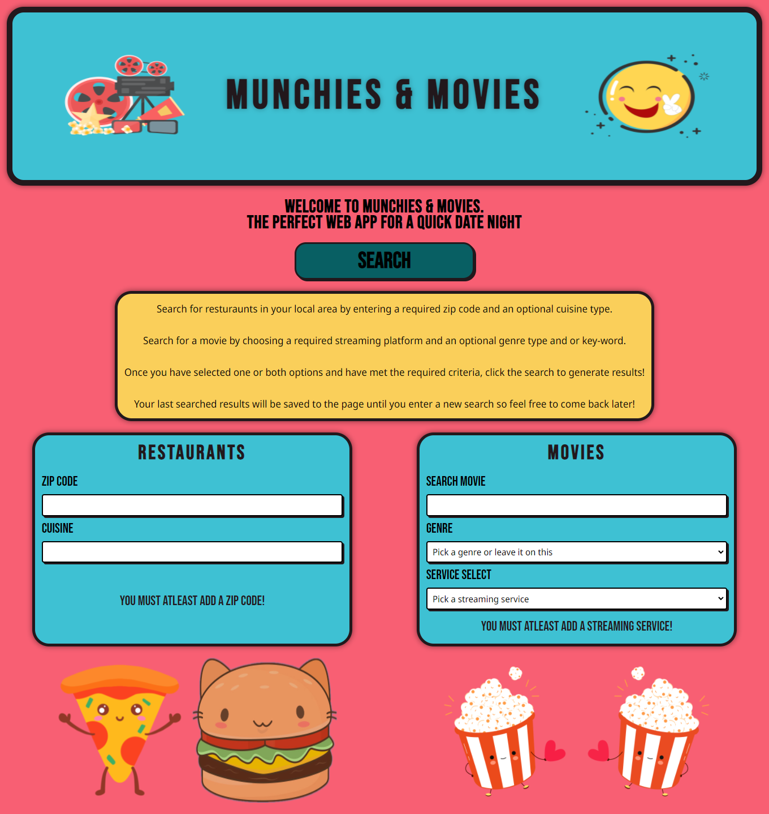

# About The Project
## Description
The name of this webpage is called Movies & Munchies

Movies & Munchies a easy and quick to use web app that allows you to search for
movies on any of your favorite streaming services and also allows you to search
for a restaurant near you! This web app is for anyone and everyone. Friends, 
family, or maybe even a nice date night with your partner.

## Code Info
To build this page we used a variety of API's, HTML, CSS, and JS. The HTML
was layed out with CSS framework called TailwindCSS to get the look and
wireframe we wanted the page to have. We also used TailwindCSS to layout the
media queries for the page. For the CSS/styling of the page we made a custom 
style sheet to fit how we wanted the page to be colored and look. For the server
side API's used in this web app, we used a restaurant API called Documenu, and a
movie streaming API called Streaming Availability. Then with the JS we have
functions that will call those API's, check for errors, and if there are none
it will generate HTML to the page.

### Built with
* Html
* Css
* Javascript
* Libraries, Frameworks, or API's
    * [TailwindCSS](https://tailwindcss.com/)
    * [jQuery](https://jquery.com/)
    * [Google Fonts](https://fonts.google.com/)
* Server side API's
    * [Documenu](https://documenu.com/)
    * [Streaming Availability](https://rapidapi.com/movie-of-the-night-movie-of-the-night-default/api/streaming-availability)

## GitHub Page and repository
* [Github Page](https://ahmed-sajjad111.github.io/Project-1/)
* [Github Repo](https://github.com/Ahmed-Sajjad111/Project-1)

## Page screenshots

## Page Contributors
* <strong>Ahmed Sajjad</strong>
  * Javascript and jQuery
* <strong>Benjamin Paulat</strong>
  * Javascript and jQuery
* <strong>Ben Vue</strong>
  * Page Styling and TailwindCSS
* <strong>Mark Carriveau</strong>
  * Html and page wireframe with TailwindCSS
* <strong>Raymond Cerney</strong>
  * Media Queries with TailwindCSS

## Contact Info

* <strong>Ahmed Sajjad</strong>
    * Email: uasajjad11198@outlook.com
    * Github: [Ahmed-Sajjad111](https://github.com/Ahmed-Sajjad111)
* <strong>Ben Vue</strong>
    * Email: BVue012@gmail.com
    * Github: [benyvue](https://github.com/benyvue)
* <strong>Benjamin Paulat</strong>
    * Email: benjamin.d.paulat@gmail.com
    * Github: [BenPaulat](https://github.com/BenPaulat)
* <strong>Mark Carriveau</strong>
    * Email: mjbc53@gmail.com
    * Github: [mjbc53](https://github.com/mjbc53)
* <strong>Raymond Cerney</strong>
    * Email: cerne004@gmail.com
    * Github: [RaymondCerneyTech](https://github.com/RaymondCerneyTech)